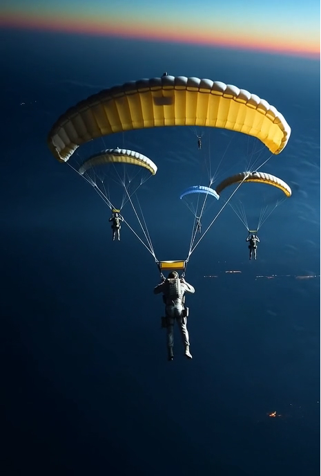

# Chapter 9: Suicide Mission 

##  A Masterful Lie

Sean made it back to the Caspian Combine. His return was quiet, his debriefing clinical. He submitted his official report, a masterpiece of truth, omission, and carefully constructed lies designed to protect his men and bury the conspirators. He knew Voss had likely vanished the moment he'd secured his stolen pension from the vault, but the official record needed to be cleaner.

---
**CLASSIFICATION: TOP SECRET – EYES ONLY**

**TO:** Office of the Inspector General, Combine Expeditionary Forces
**FROM:** 2nd Lt. Sean Walker, SO-GSD
**SUBJECT:** After-Action Report: Loss of Command, Detachment 7, Aethelgard, Erden

1.  **SITUATION:** Following the unsanctioned nuclear detonation in Aethelgard, Detachment 7 was ordered by Captain Eric Voss to enter the blast zone to secure the Parliament building. Captain Voss stated he had received credible intelligence that Erden forces had cached large quantities of Federation-supplied gold bullion in the Parliament vault as an emergency war reserve.

2.  **ACTION:** Captain Voss deemed this a time-critical intelligence and salvage opportunity. He ordered the entire platoon, including the undersigned, to breach the vault. Upon entry, Captain Voss personally supervised the loading of an unmarked civilian hover-truck with an estimated 1.2 metric tons of gold bullion and hard currency.

3.  **COMMAND DECISION:** At 02:14 local time, Captain Voss informed the platoon that he would personally drive the truck to a pre-arranged Combine extraction point for ‘immediate repatriation of strategic assets’. He gave a direct and explicit order for all remaining personnel to continue the humanitarian cover mission with the civilian refugees until relieved.

4.  **LOSS OF CONTACT:** Captain Voss departed alone. Radio contact was lost within minutes due to lingering electromagnetic interference. No member of the platoon has seen or heard from Captain Voss since that moment. His current status is unknown.

5.  **SUBSEQUENT ACTIONS:** After it became clear Captain Voss was no longer in communication and had abandoned the unit, I assumed command. All subsequent actions, including the escort of 1,500 refugees to Northgate and the improvisation of the armored train escort, were carried out on my own initiative to preserve the lives of Combine soldiers and the civilian refugees.

6.  **ASSESSMENT:** We have no knowledge of Captain Voss’s current whereabouts. It is my professional assessment that he has either defected with the stolen assets or was intercepted and killed by Erden partisans.

---

Before they had crossed back into Combine territory, Sean had gathered the handful of privates who had survived with him. His message was quiet and direct.

"There are two versions of this story," he told them, his eyes meeting each of theirs. "In the first version, we report exactly what's in that document. We blame Voss for everything, we go home as heroes who saved 1,500 people, and this whole nightmare is over. In the second version, we tell the truth about what we saw other companies doing. Intelligence will bury us all for 'losing strategic assets' and for witnessing something we shouldn't have. They'll make us disappear. Choose wisely."

They all chose the same story. It was the truth from where they stood, and it kept them alive.

Sean attached one final, private addendum to the file, for the eyes of the Inspector General only: *“It is my recommendation that Captain Voss be declared Missing in Action, Presumed Defected with State Assets. Officially closing the matter prevents a significant propaganda victory for the Meridian Federation and avoids deep institutional embarrassment.”*

He knew the Combine’s leadership. They hated embarrassment more than they hated losing gold. And while they might not have believed every word of his story, it was clean, it was plausible, and it gave them an easy way out. The file was closed.

---
## Task Force Revenant

Sean’s “hero” status was short-lived. Though his report had closed the file on the Erden disaster, he was now a man who knew too much, a loose end. He was quietly reassigned. His new mission: pilot for a high-risk rescue team.

The objective was to extract Combine embassy staff and a voluntary medical team who had been trapped in Aethelgard when it fell. They were now being held in a Federation prison facility following the collapse of Corvus's regime.

The field commander, Major Ivan Rostova—a mountain of a man known as "The Ox"—finished the briefing. The mission was clear: infiltrate Federation territory and liberate the prisoners. It sounded simple. It was anything but.

As the team prepared their gear, someone clapped Sean hard on the shoulder. "If it isn't the Hero of Erden," a sly voice said. "What's a man like you doing in a place like this?"

Sean turned. He'd recognize the sly grin anywhere. It was Leo Vance, his former roommate from the academy, a man whose hobby had always been collecting secrets.

"I'll tell you why," Leo continued, not waiting for an answer, his voice dropping. "Because this is a suicide mission."

"Aren't they all?" Sean replied, his voice flat.

Leo's grin faded. "No, this one's different. We're the fourth team they've sent. The last three were captured by the Federation in less than twenty-four hours. It's a meat grinder."

Leo lowered his voice, his eyes darting around the hangar. "The deputy ops officer, a Colonel Volkov, demanded a full stop to review the intel. He argued the Federation had to be anticipating our moves. But High Command ignored him, doubled down, and just upgraded the gear and the CO." He nodded towards the Major. "That's Rostova. The Ox. Former battalion commander. He ended up here after he 'discovered' the neutron-bomb arsenal was producing fifty percent more warheads than officially declared. They tried to court-martial him for treason, but the case fell apart. His career, however, did not."

Leo subtly pointed to a sharp-eyed woman cleaning her rifle. "That's his sister, Captain Eva Rostova. In Erden, she disobeyed a direct order to stand down and single-handedly wiped out Sirona’s entire Fourth Battalion when they tried to level a village full of civilians. She saved the village but ended her career."

His gaze drifted over the rest of the team. "See the two intel guys, Fedor and Anya? They separately wrote memos proving Combine 'humanitarian' convoys were being used to smuggle arms to Sironan militias during the ceasefire. The memos were buried, and so were they. The logistics officer? Refused to sign off on 400 tons of aviation fuel that vanished into a general's private accounts. The squadron commander over there? Refused to falsify an after-action report to cover up friendly-fire casualties."

Leo looked back at Sean, his meaning clear. "This isn't a rescue team, Sean. This is Task Force Revenant. We're the ghosts. Everyone here has, at one time or another, done the right thing and embarrassed the wrong general. We're the ones they want to disappear."

Sean didn't reply directly. He just looked at the men and women around him—the stubborn major, the fierce captain, the honest intelligence officers. He thought of Captain Voss and the looters in the vault.

"I know why you're here, Leo," Sean said, a grim smile touching his lips for the first time in weeks. "You know too much and you talk too much."

A sense of dread still hung over the mission, a feeling that they were being sent to their deaths. But for the first time since his return, a different feeling surfaced alongside it: pride. He was finally with soldiers he could respect.

---

## Ambush

The briefing for Task Force Revenant took place at 38,000 meters, inside the belly of a stealth transport screaming over Federation territory. They were flying in a pair of old, heavily modified birds, running dark.

*Revenant Zero-One*, piloted by Leo, carried the primary assault element: Major Rostova and seven operators, plus their gear.

*Revenant Zero-Two* was Sean’s bird. He carried the four-man reserve and recon element. His mission was simple: drop his team ninety seconds after Zero-One, then climb to high orbit and wait. He was the eye-in-the-sky and the only ride home.

Both aircraft flew nap-of-the-earth, no lights, hugging the terrain with their guidance radars, electronic spoofers churning out a stream of ghost signals. Inside, the cabin was a sea of red combat lights as the team performed their final suit checks.

While the operators armed their weapons, Sean idly glanced at the cockpit repeater displaying the final, pre-programmed drop coordinates. A knot of ice formed in his stomach. The LZ wasn't the one they had briefed. The new coordinates were 4.8 kilometers east of the original site—deep inside the known patrol box of a Federation rapid-reaction brigade.

*Did Intel move the drop zone, or was this a setup?*

At 01:14 local time, Leo flared *Zero-One* over the new LZ, a small, dark clearing in the woods. The assault team fast-roped down. The moment the last man hit the ground, all hell broke loose.

The night exploded. Infrared laser designators snapped on from all directions, painting *Zero-One* in a spiderweb of crimson light. An instant later, the clearing was stitched with a storm of non-lethal fire. Federation shock troops rose from the darkness, firing stun nets and hypersonic tasers that crackled through the air. The drone-turrets, instead of cannons, launched grappling hooks that slammed into *Zero-One*'s fuselage, anchoring it to the ground.

It was a perfectly executed capture ambush.

Twenty kilometers back, alarms screamed through Sean’s cockpit. He saw Leo fighting the controls as shock troops swarmed the disabled transport. He banked hard, opening up with his own cannons—not to kill, but to suppress, to give them a chance.

His fire forced the Federation troops to take cover, momentarily loosening their grip. He saw *Zero-One*, trailing smoke and sparks, lurch back into the air. But it was a fatal, desperate climb. A missile, likely an EMP rocket, streaked up from the darkness and struck the cockpit. The transport shuddered, its engines dying, and began to autorotate towards the ground. On his screen, the nine life signs of the assault team were still active, but they were going down. Captured.

Another missile alert screamed. This one was for him.

He felt the impact a second later—a violent, tearing shudder as an EMP missile ripped through his electronics. The transport's systems died, the cockpit plunging into darkness, the only sound the shriek of the wind and the automated klaxon screaming, "MANUAL BAILOUT! MANUAL BAILOUT!"

"Out! Rear ramp! Go, go, go!" Sean roared to his team over the now-failing intercom. He fought the dead controls, trying to keep the dying bird gliding for just a few more seconds. He felt the shift in balance as his four operators ran for the ramp and jumped into the darkness. Then, with the ground rushing up to meet him, he unstrapped himself and sprinted for the open ramp himself.

He threw himself into the night, pulling his own chute cord just as the wreckage of *Zero-Two* slammed into a hillside a kilometer away, the explosion lighting up the sky.

He was alive. He was alone.

He scrambled for cover under a broken stone bridge as the searchlights of Federation helicopters began to sweep across the ground, hunting for survivors. Once again, he was behind enemy lines, with nothing but the uniform on his back, the faces of his captured team burned into his mind. The suicide mission had lived up to its name.

#### Scene from this Chapter:    

***"Out! Rear ramp! Go, go, go!" Sean roared to his team over the now-failing intercom. He fought the dead controls, trying to keep the dying bird gliding for just a few more seconds. He felt the shift in balance as his four operators ran for the ramp and jumped into the darkness. Then, with the ground rushing up to meet him, he unstrapped himself and sprinted for the open ramp himself.***

---

# Chapter 10: Infiltration

Comming soon....

--- 
[Previous Chapters](../)    
