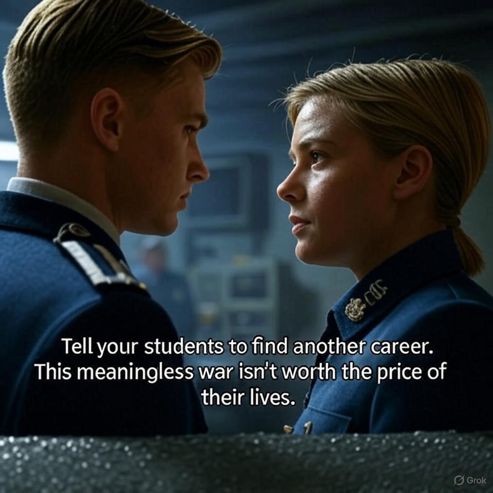
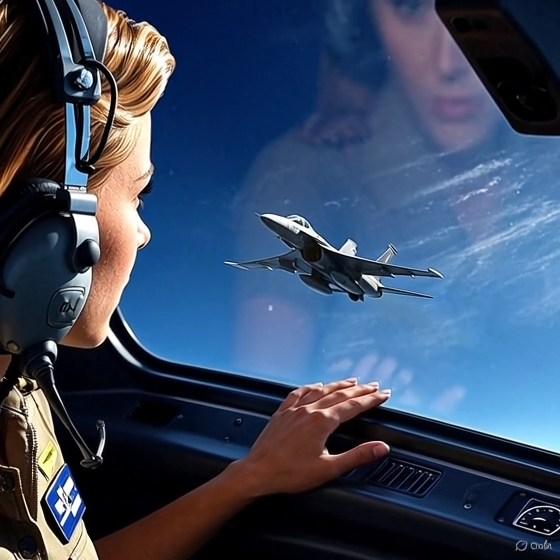
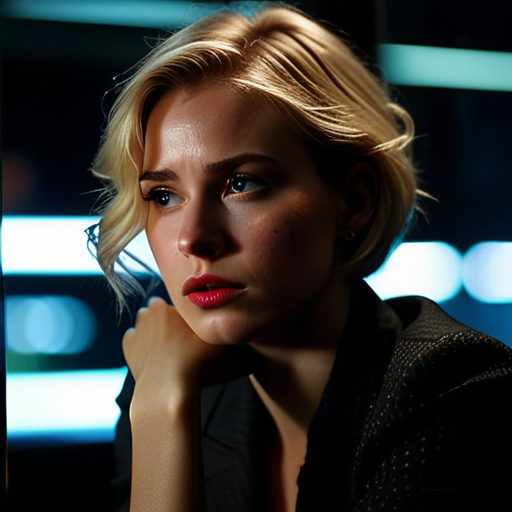
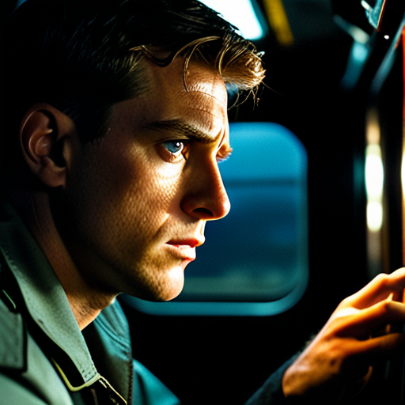
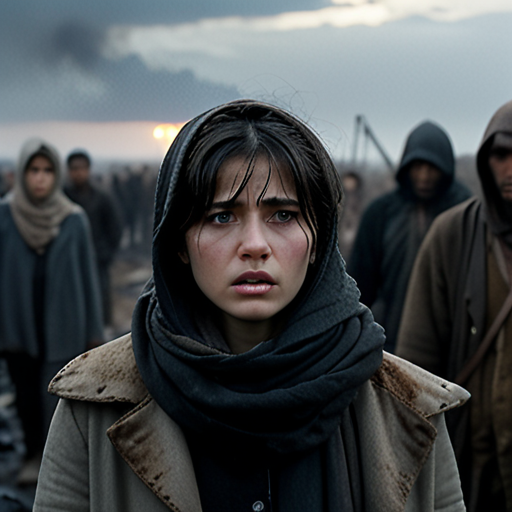
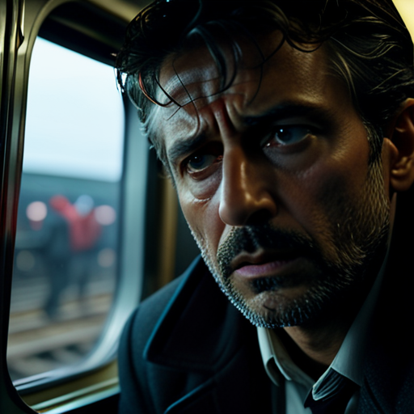

# The Inverted Sky

## Main Characters

### Ruby Vance (The Meridian Federation  )

 **Archetype:** The Idealist in a Cynical World

Born into a dynasty of diplomats, Ruby was groomed from birth to navigate the intricate dance of international politics. On the surface, she is the perfect envoy: impeccably educated, fiercely intelligent, and possessing a tough, analytical mind that can dissect any political problem. Her appearance —- short blonde hair and sharp, tailored suits—projects an aura of no-nonsense capability.

Beneath this polished exterior, however, lies a deep-seated conflict. She sees the fervent patriotism preached by her leaders for what it is—a convenient shelter for greed and ambition. This has caused her to grow weary of her own country's relentless warmongering, leaving her caught between a nominal duty to her nation and the urgent pull of her conscience. This has fostered a profound, well-guarded empathy for the people caught in the crossfire of conflicts she is sent to manage. While her influence is limited, she skillfully uses every tool at her disposal—her intellect, her family name, and her sheer force of will—to mitigate damage and protect lives, all while wrestling with the moral compromises her position demands.

### Sean Walker (The Caspian Combine )
 **Archetype:** The Survivor with a Conscience

Sean is a product of the harsh realities of his world. Sent to a military academy at a young age not for glory but for survival, he learned early on that institutions are often corrupt and that authority is not to be trusted. His intelligence is not academic but adaptive and razor-sharp, honed by years of observing and navigating the "dirty politics" and injustices of a system designed to break men like him.

He carries himself with a lean, watchful intensity, his eyes holding the weary look of someone who has seen too much. He views the nationalistic propaganda that fuels the war with a profound cynicism, recognizing it as a tool the authorities use to manipulate the populace and justify their actions. Sean is a master at playing the game; he understands the rules of the powerful and knows how to bend them to survive. However, this cynicism is at constant war with a stubborn, unyielding conscience. He despises the system he is a part of and refuses to become one of the predators he sees in positions of power. His graduation to Second Lieutenant is not a triumph, but a deeper entanglement in a life he never chose, forcing him to constantly seek a path where he can be effective without sacrificing his soul.

 Secondary Characters

**Undersecretary Thorne (Meridian Federation)**  
  
A cold, pragmatic, and powerful bureaucrat in the Federation's Ministry of State. Thorne is a master of political maneuvering who sees people and nations as pieces on a chessboard. He is Ruby's superior and represents the cynical, amoral realpolitik of the superpower she serves.

**Captain Eric Voss  (Caspian Combine)**  
  
An incompetent and cowardly officer in the Combine army, Voss is a product of a system that rewards loyalty over ability. He is Sean's direct commander in Erden and embodies the bureaucratic rot and moral corruption that Sean despises, prioritizing personal gain and self-preservation above all else.

**President-Marshal Lysander Corvus (Sirona)**  
  
The ruthless dictator of Sirona. For fifteen years, Corvus has clung to power through fear and the backing of his patrons in the Meridian Federation. He is paranoid, ambitious, and willing to start a war and risk nuclear catastrophe to save his own regime.

**President Kaelen Rask (Erden)**  
  
The democratically elected President of the Republic of Erden. A strong, resilient, and principled leader, she is caught in an impossible situation: fending off an invasio

**Lisa Aris (Erden)**  
   
The acting mayor of the town of Oakhaven. After her father was called to defend the capital, Lisa was thrust into a leadership role she never wanted. She is young, overwhelmed, but fiercely protective of her people, representing the civilian struggle and resilience of Erden.

**The Agent (Sirona)**  
   
A high-ranking Sironan official chosen to be the puppet leader of Corvus's "Western Erden." Wracked with guilt and fear, he attempts to defect to Erden to expose the conspiracy, inadvertently becoming the "package" Sean must protect. He represents the moral cowardice that enables tyrannical regimes.

**General Valerius (Sirona)**  
  
A high-ranking and ambitious Sironan general, Valerius is a key player in the conspiracy between Corvus and the rogue Combine faction. He is arrogant, short-tempered, and dangerously overconfident in his own importance. While he is a competent field commander, his ego and explosive anger are significant weaknesses. He views the war and the conspiracy primarily as a means to his own personal advancement and enrichment, making him susceptible to manipulation by anyone who can successfully play on his pride and greed. He is the Sironan officer who captures Sean and is ultimately outwitted by him.

---

 A Primer on the Galactic Powers 

### The Meridian Federation 

The dominant superpower in the known galaxy, the Meridian Federation presents itself as a stable, sophisticated, and enlightened republic, a beacon of order and prosperity. In reality, its vast bureaucracy is driven by a cold, cynical realpolitik, and it maintains its dominance through a web of client states, economic control, and overwhelming military might. Led by a powerful, often unseen Ministry of State, the Federation views the rest of the galaxy as pieces on a chessboard, to be managed and manipulated for its own long-term security and influence. Ruby Vance is a product of its elite diplomatic corps.

### The Caspian Combine 

A rising, industrial superpower forged from a union of resource-rich worlds, the Caspian Combine is the primary rival to the Meridian Federation. The Combine's ideology is one of collective strength, pragmatism, and relentless ambition. While officially a democracy, its government is deeply intertwined with its powerful military-industrial complex, creating a society that values utilitarian strength over individual liberty. The Combine is seen by the Federation as a brutish, expansionist threat, while it sees itself as the only power strong enough to challenge the Federation's galactic hegemony. Sean Walker is an officer in its formidable air force.

### The Republic of Cygnus 

A staunchly neutral and immensely wealthy nation, the Republic of Cygnus has carved out a unique position between the two rival superpowers. Famous for its luxurious resorts, discreet banking systems, and role as a neutral ground for high-stakes diplomacy, Cygnus is the Switzerland of the galaxy. Its government prioritizes economic prosperity and unwavering neutrality above all else, making its territory a safe haven for spies, diplomats, and anyone seeking refuge from the galactic conflict—as long as they can afford the price of admission and agree to leave their wars at the border.

### The Republic of Sirona 

An authoritarian state masquerading as a republic, Sirona is a client nation of the powerful Meridian Federation. For fifteen years, it has been under the iron-fisted rule of President-Marshal Lysander Corvus, who relies on Federation military support to suppress dissent and maintain his power. With a faltering economy and growing internal unrest, Corvus's regime initiated the war with its neighbor, Erden, under the false pretext of "liberating" the Sironan-speaking populace. Sirona is a nation built on a foundation of aggressive nationalism, political paranoia, and a desperate need to project strength to hide its internal decay.

### The Republic of Erden 

A resilient and sovereign democracy, the Republic of Erden is a nation defined by its fierce independence and the determination of its people. Led by the popularly elected President Kaelen Rask, Erden finds itself caught between two hostile superpowers. Threatened by the aggression of its neighbor, Sirona, Erden has entered into a fragile, mistrustful alliance with the Caspian Combine for protection. While the Combine's support is limited and comes with its own agenda, the people of Erden are united in their fight for their land, their freedom, and their right to self-governance, embodying a spirit of endurance against overwhelming odds.

---

--- 
## Chapter 1: Acquaintance

A thousand years from now, the world had forgotten peace. For a decade, nations bled under the iron fist of perpetual war, their conflicts fueled by the insatiable hunger for resources and the toxic pride of global dominance. In this broken world, Sean, a young man forged in poverty, was on the cusp of graduating from the air force academy. His final test was not in the cockpit of a fighter jet, but on the ground, as a mentor leading a group of junior students on a field training exercise.

Their return home was a descent into chaos. An unexpected Meridian Federation offensive had swallowed the land, turning their path into a war zone. Now, they were rats in a maze of rubble, hiding in the shell of a shattered building in the Blue Lake district, the enemy's pursuit a constant, looming threat.

Ruby, a diplomat from the Meridian Federation, was also a prisoner of this sudden violence. Born to wealth and privilege, she was on her way home from a diplomatic mission aimed at forging fragile alliances. An armed, professional escort team was her shield, but in the maelstrom of the offensive, the shield had broken. Separated from her protectors, she stumbled into the same ruined building where Sean and his students were hiding.

The sight that greeted her was a tableau of fear and defiance: a young officer and a handful of cadets, their uniforms marking them as the enemy.

Outside, the shouts of her escort team echoed through the ruins, drawing closer. Sean heard them too. He was outmanned, outgunned, and trapped. He looked at the diplomat, his mind racing. He made a choice.

"You can turn me in," he said, his voice steady despite the tremor in his hands. "But let them go. They're just kids, not soldiers yet."

Sean and Ruby locked eyes, a silent battle of wills raging in the space between them. He saw a flicker of something in her gaze – not hatred, but a weary sorrow. She, in turn, saw not a monster, but a young man prepared to sacrifice everything for the lives of others. The tension was a physical thing, a heavy weight in the dust-filled air.

As the footsteps of her team grew louder, just outside their hiding place, a sigh escaped Ruby's lips. "Tell your students to find another career," she said, her voice barely a whisper. "This meaningless war isn't worth the price of their lives."

She turned and walked away, melting back into the shadows from which she had emerged. A moment later, Sean heard her voice, clear and strong, calling out to her team, leading them away from the building.

In the silence that followed, Sean let out a breath he didn't realize he'd been holding. He didn't know her name, but he knew he owed her his life, and the lives of his students. In the depths of his heart, a silent "thank you" was offered to the enemy who had shown him mercy. With a newfound resolve, he gathered his students, and together, they navigated the treacherous path back to their own lines, the memory of the mysterious diplomat burned into his mind.

***Tell your students to find another career, this meaningless war isn't worth the price of their lives!*** [sample vidoe](https://youtube.com/shorts/jxhw0d7C8PU)

---

## Chapter 2: Reunion

Months later, the title of Second Lieutenant was fresh on Sean’s collar. He was no longer a cadet but an official pilot, the cockpit of his fighter a second skin. The endless sky was a welcome escape from the politics on the ground. One day, a routine patrol near the border was shattered by a priority alert: a suspicious, unidentified aircraft attempting a clandestine border run.

Following protocol, Sean located the craft, a sleek private transport half-hidden by the dense forest canopy below. Duty demanded he report it immediately. But something held him back—a gut feeling, a memory. He deployed a micro-drone, its stealth optics feeding a silent stream of data to his console. As the image resolved, his breath caught in his throat. In the passenger seat of the enemy craft was Ruby.

The sight of her—the woman who had saved him and his students—sent a jolt through him. His duty was clear, but the memory of her quiet act of mercy was clearer. His subconscious didn't just suggest a course of action; it screamed it. He killed the uplink to headquarters. For now, this was his secret. He would follow her, a ghost in the sky, and understand her purpose.

His surveillance revealed a desperate, suicidal flight plan. Ruby's transport was heading for the "Dead Man's Corridor", a narrow passage infamous for its overlapping fields of anti-air batteries. Without a valid, friendly authorization code, her plane would be shredded by automated defenses long before it reached the border.

There was no time. Under the blanket of total radio silence enforced in the zone, he had no way to warn her. No way but one.

He pushed his engines, closing the distance. Her crew, seeing a hostile fighter approaching at speed, armed their weapons. Alarms lit up Sean's console. He ignored them. He activated his plane's external flashlight, aiming it at her cockpit and began to flash a frantic message in Morse code.

DANGER AHEAD. TURN BACK.

The response was a warning shot that streaked past his canopy. He held his course, his own plane's alarms screaming. He flashed again, this time adding a personal plea.

REMEMBER YOUR ADVICE. TO MY STUDENTS. TRUST ME.

Inside Ruby’s transport, confusion turned to shock. Her pilot was shouting about the madman in the fighter jet. But Ruby saw the flashes, understood the message. *Your advice to my students.* There was only one person it could be. With her heart pounding, she made a choice born of faith. "Do not fire!" she commanded her crew. "Let him approach."

Sean flew impossibly close, the wingtips of their aircraft nearly touching. He began broadcasting his own plane's authorization code on a wide, powerful frequency, hoping the signal was strong enough to envelop her transport in a protective bubble. To the automated defense systems, they had to appear as one.

"I'm declaring a technical emergency," he reported to his own headquarters, his voice a mask of calm professionalism. "Flight controls are unstable. Maintaining altitude to diagnose."

Then came the maneuver—a feat of impossible airmanship. He inverted his fighter, flying upside down directly above her transport, extending his variable-geometry wings to their maximum width. The goal was to merge their two radar signatures into a single, larger blip that matched his friendly code. The strain on his body and his aircraft was immense. The controls screamed in his hands, every muscle straining to hold the formation steady.

For a breathtaking moment, as their planes flew in perfect, terrifying unison, they locked eyes through their respective canopies. He saw the fear and astonishment on her face, but also a profound, silent gratitude. She saw the raw concentration and determination etched on his.

Finally, they left the "Dead Man's Corridor". The last threat icon vanished from his screen. He peeled away, his jet rolling upright as he broke the formation. Ruby's transport was safe, a clean vector to the border. As her plane sped away, she pressed a hand to the cold glass of the window, her heart aching with a silent thank you, and a question that would haunt her: in a world without war, who could they have been to each other?

***Do not fire!" she commanded her crew. "Let him approach."***[sample video](https://youtube.com/shorts/jEdfX7f5Lkw)

---
# Chapter 3: The Devil's Bargain

Upon her return to the Meridian Federation's capital, Ruby stood before the Ministry of State's debriefing council. The room was sterile, the faces of the officials impassive. When they asked about the unidentified fighter that had shadowed her through the Dead Man's Corridor, she delivered the lie she had rehearsed a hundred times.

"The pilot signaled his intent to defect," she stated, her voice a mask of calm professionalism. "He escorted us to the border, but lost his nerve at the last moment and turned back." The lie tasted like ash, but it was the only shield she could offer the man who had saved her life.

The council moved on. The true purpose of her mission had been to assess the viability of an alliance with a brutal warlord faction known as the Scourge of Kassian, who were fighting to overthrow the Caspian Combine's government. In her report, Ruby was unequivocal. She detailed the Scourge's atrocities—massacres, human trafficking, genocide—with cold, factual precision. Her official recommendation was stark: "Alliance with this group is fundamentally against the strategic and moral interests of the Meridian Federation. They are not liberators; they are bandits and war criminals."

A week later, she was summoned to the office of Undersecretary Thorne. He didn't ask her to sit.

"Your report was... thorough," Thorne began, his voice smooth as polished stone. "However, the Ministry has decided to proceed with the alliance." He slid a data slate across his desk. "Intelligence confirms the Scourge has deeply infiltrated the Combine's command structure. Their chances of success are high."

Ruby stared at him, incredulous. "Sir, their 'command structure' is a network of thugs. Did you read the addendum on their human rights record?"

"I did," Thorne said, his eyes cold. "And you will now prepare the necessary materials to sanitize it. Press releases, a Q&A for the conference, the presentation for the Senate hearing, and the official line for the media. The hearing is next week. The Senate's endorsement is a formality, after which we will begin funneling weapons and funds. You have one week."

The room tilted. The air grew thin. During her mission, she had seen what the Scourge did to their enemies. She had walked through a village where every man, woman, and child had been slaughtered to make an example. She had heard the stories of their rape gangs. "How?" she whispered, the question hanging in the air. "How can our government help those... monsters... get into power?"

"That is not your concern," Thorne replied, his tone final. "Your concern is the narrative. Your claim that their infiltration is a bluff has been noted and dismissed. This is the final decision."

For two days, Ruby sat in her office, the blank screen of the press release mocking her. Every time she tried to write a sentence—*A new era of partnership... A courageous step towards freedom...*—her mind was flooded with the faces of the Scourge's victims. The words choked her.

Then the whispers began. They slithered through the Ministry's halls, dripping with ambition. *Ruby Vance is cracking under the pressure. She's unfit for the job. She's about to be replaced.* She knew the sharks were circling, colleagues who coveted her position and would gladly write the lies she could not. The pressure was a physical weight, a crushing force on her chest that made it hard to breathe.

Late one night, alone in the silent expanse of her office, she saw her reflection in the dark window overlooking the city lights. She looked tired. Defeated. She raised a hand, touching the cold glass as if to steady the trembling image staring back at her.

"Will I become a monster," she whispered to her reflection, "to help another monster harm the innocent?"

She blinked, and a single, hot tear broke free, tracing a path down her cheek. It was not a tear of sadness, but of terrifying clarity. The system wasn't asking for her expertise. It was demanding her soul.

***"Will I become a monster," she whispered to her reflection, "to help another monster harm the innocent?"***
[Sample video](https://youtube.com/shorts/XLicumz4jJ8)

---
# Chapter 4: The Gambit

Ruby did not sleep. She remained in her office, a ghost in the silent ministry as the city slept. When the morning light streamed in and her colleagues returned, a cold resolve had settled over her. She would give Thorne exactly what he wanted.

She became a whirlwind of chilling efficiency. She drafted the press conference materials, transforming the Scourge of Kassian from butchers into valiant freedom fighters. She called key senators, using her political acumen to probe their positions and tailor the hearing presentation to their vanities and fears. She worked around the clock, her fingers flying across the console.

By Friday, it was done. She placed a data slate on Undersecretary Thorne’s desk. It was a masterpiece of propaganda: a flawless press release portraying the warlord as a saviour, a hearing presentation arguing the alliance as a moral imperative, and a powerful speech for the Minister of State justifying the flow of weapons as an act of justice.

Thorne was visibly impressed. "Exceptional work, Vance. I knew you had it in you."

"Thank you, sir," Ruby said, her voice carefully modulated to sound weary. "The assignment was draining. I'd like to request a short leave for the weekend. A trip to the Republic of Cygnus for some refreshment. I'll be back Monday to see this through."

"Granted," Thorne said, pleased with his subordinate's apparent dedication. "You've earned it."

That evening, Ruby boarded a transport to Cygnus, a neutral nation famous for its luxurious resorts. She carried only a small bag, but inside it was an encrypted data scrambler—a piece of contraband tech that was her only hope.

She checked into a hotel under a fake name and a forged ID. In the political neutrality of Cygnus, communication with the Caspian Combine was unrestricted. She navigated to a propaganda forum for the Combine's air force, a place filled with jingoistic pilots and fans. Using an attractive profile picture and a new persona, she began to fish. After a few posts asking innocent, fawning questions, she set the hook. In a public thread, she asked: "Hypothetical question for the pilots here: why would anyone use Morse code in a heavy air defense area during an emergency?"

The question, specific and odd, was just enough. Soon, a private message appeared in her inbox for a private chat. It was from Sean. His first thought was: *Is this a trap?* But the fear that Ruby might be in danger overrode his caution.

**Sean:** In an emergency, you use a designated distress frequency. Morse code is obsolete.

**Ruby:** What if the goal wasn't to call for help, but to appear as a single radar signature? By, for example, flying inverted directly above another plane?

**Sean:** ...What plane?

**Ruby:** ...

**Sean:** A TF35 transport?

**Ruby:** ...

**Sean:** ...From the Meridian Federation?

**Ruby:** Do you still remember my advice?

**Sean:** ...

**Ruby:** In the Blue Lake district.

A thrill of cold electricity shot down Sean's spine. It was her.

**Ruby:** Follow this link. The password is the first two words of my advice. All lowercase, no spaces.

Sean immediately terminated the chat, his heart pounding. He switched to a secure terminal, routing his connection through a dozen anonymizing proxies before accessing the dark web link. He entered the password: `findanother`. The chat window opened.

**Sean:** I remember proposing to surrender in the ruins of the city hall. Are you in danger?

**Ruby:** No. But your nation is. I am sending you a package. First-hand, unedited intelligence. Images, videos. My private collection, shared with no one. You will leak it—anonymously—to an anti-government news outlet in my country called The Clarion. The leak must appear to come from a mole within the Scourge itself. Once you see the files, you'll understand.

**Sean:** What are the risks?

**Ruby:** For you? If caught, you're a whistleblower, a national hero. For me, it's treason. I'm trusting you not to disclose the source. Proceed with care.

Sean downloaded the files. The raw, brutal truth of the Scourge's atrocities flooded his screen. The rumors were true. He felt a surge of cold fury, followed by a wave of profound admiration for the woman on the other side of the screen.

**Sean:** I'll make it look like it came from the warlord's inner circle. How do I contact you again?

**Ruby:** The less we communicate, the safer we are. I will find you if needed. You can track my status through official Federation media... if I'm still there. Take care. Ruby Vance, out.

*Ruby Vance.* The name hit him like a physical blow. He knew of the Vance dynasty. He never imagined it could produce someone like her.

On Monday, Ruby was back at her desk, a model of professionalism. She pretended to be busy preparing contingency plans for the hearing, while her heart hammered against her ribs in anxious anticipation. On Tuesday morning, The Clarion broke the story. The headline was explosive: "FEDERATION'S NEW ALLIES: HEROES OR BUTCHERS?"

The story went viral. The unedited images and videos were undeniable, sparking international outrage. Ruby, feigning crisis-management mode, presented her "contingency plan" to Thorne. "The leak appears to be internal to the Scourge," she said with professional gravity. "The data corresponds to intel one of their lieutenants would possess. Our cover-up attempts are only making it worse."

By evening, public opinion had turned into a landslide of condemnation. Under immense pressure, the Ministry of State officially suspended the alliance and cancelled the hearing. Ruby allowed a flicker of disappointment to cross her face in front of Thorne, but inside, she felt the purest, most profound relief of her life.

Days later, Sean tried the dark web link again. It was dead. The forum account was deleted. He scanned the Federation news, but couldn't find any mention of Ruby. When he hacked into the Ministry's public directory, her name was still there, a small but significant relief. Follow-up reports on The Clarion detailed the aftermath: the leak had exposed the Scourge's key positions, forcing them into a full retreat and allowing for the rescue of hundreds of captives. Ruby's brave act had saved thousands of lives.

*Ruby Vance.* The name was now etched in his mind. Her bravery and unwavering determination to uphold her conscience in the face of treason deeply impressed his heart. He looked out at the sky, wondering what the world could be if more people in power were like her—willing to risk everything for what was right.

***The less we communicate, the safer we are. I will find you if needed. You can track my status through official Federation media... if I'm still there. Take care. Ruby Vance, out***  
[sample video](https://youtube.com/shorts/7slHHGAvn-k)

---
## Chapter 5: Looting

Introduction of The Republic of Sirona 

An authoritarian state masquerading as a republic, Sirona is a client nation of the powerful Meridian Federation. For fifteen years, it has been under the iron-fisted rule of President-Marshal Lysander Corvus, who relies on Federation military support to suppress dissent and maintain his power. With a faltering economy and growing internal unrest, Corvus's regime initiated the war with its neighbor, Erden, under the false pretext of "liberating" the Sironan-speaking populace. Sirona is a nation built on a foundation of aggressive nationalism, political paranoia, and a desperate need to project strength to hide its internal decay.  
  
---

Introduction of The Republic of Erden 

A resilient and sovereign democracy, the Republic of Erden is a nation defined by its fierce independence and the determination of its people. Led by the popularly elected President Kaelen Rask, Erden finds itself caught between two hostile superpowers. Threatened by the aggression of its neighbor, Sirona, Erden has entered into a fragile, mistrustful alliance with the Caspian Combine for protection. While the Combine's support is limited and comes with its own agenda, the people of Erden are united in their fight for their land, their freedom, and their right to self-governance, embodying a spirit of endurance against overwhelming odds.  
  
---

 Secondary Characters

  
**Captain Eric Voss  (Caspian Combine)**  
  
An incompetent and cowardly officer in the Combine army, Voss is a product of a system that rewards loyalty over ability. He is Sean's direct commander in Erden and embodies the bureaucratic rot and moral corruption that Sean despises, prioritizing personal gain and self-preservation above all else.

**President-Marshal Lysander Corvus (Sirona)**  
  
The ruthless dictator of Sirona. For fifteen years, Corvus has clung to power through fear and the backing of his patrons in the Meridian Federation. He is paranoid, ambitious, and willing to start a war and risk nuclear catastrophe to save his own regime.

**President Kaelen Rask (Erden)**  
  
The democratically elected President of the Republic of Erden. A strong, resilient, and principled leader, she is caught in an impossible situation: fending off an invasio

---

President-Marshal Corvus promised his people a swift and glorious victory. The invasion of Erden was meant to last a month. It had now bled for more than a year.

It began as a desperate gambit by President-Marshal Lysander Corvus of Sirona. For fifteen years, his dictatorship had been propped up by the military might of the Meridian Federation, a force he used to crush any internal dissent. But with the voices of uprising growing louder in his own streets, Corvus needed a distraction—a glorious, unifying war. He turned his eyes to his neighbor, the Republic of Erden, and launched an invasion under the false pretext of liberating the Sironan-speaking people who lived there.

He expected a quick victory. He underestimated the people of Erden.

Under the leadership of their democratically elected President, Kaelen Rask, the people of Erden fought with a ferocity Corvus could not comprehend. They knew what they were fighting for. President Rask had forged a strategic, if fragile, alliance with the Caspian Combine, hoping their military power could act as a shield. The Combine, for its part, saw Erden as a potential buffer state against the Meridian Federation and agreed to provide limited support, though their true aim was to install a more compliant puppet government.

Now, a year of brutal attrition had pushed both nations to the brink of collapse. The rot was deeper in Sirona, where the "quick victory" had become a bloody quagmire. The propaganda posters rang hollow. Across the nation, the "Don't Send Our Sons to the Grave" movement gained traction, with decorated veterans joining the protests. To save his regime, Corvus decided to stake everything on one last, decisive blow, convinced he held a hidden trump card that would finally win him the war.

As part of the Combine’s newly endorsed troop deployment, Sean Walker found his wings clipped. Reassigned from his fighter squadron, he was now attached to a ground support company, tasked with piloting transport craft and providing close air support for the push to defend Erden’s capital, Aethelgard.

His commanding officer was Captain Eric Voss, a man who was a perfect product of the Combine's bureaucracy: utterly incapable in any practical sense. Sean watched him, a knot of dread in his stomach. Two days ago, Voss, utterly lost and misreading his own command console, had nearly marched the entire company into a Sironan minefield. Only a frantic, screaming old farmer, running from his steading, had saved them.

Without the people of Erden, their company would have been a line of smoking craters before they ever saw the capital. The locals gave the Combine soldiers everything they had—a loaf of precious bread, a cup of clean water, a whispered warning about an enemy patrol. Sean saw the hope in their tired, desperate eyes. They looked at the soldiers of the Caspian Combine not as cynical allies, but as saviors. They were counting on this reinforcement to help them defeat the invaders, a faith Sean feared was tragically misplaced.

By the time Sean’s company reached the outskirts of Aethelgard, the city was already a skeleton. Sirona’s relentless air raids had shattered its defenses, leaving it exposed and vulnerable. Key infrastructure lay in ruins, and the sky was a permanent, bruised grey from the smoke of a hundred fires. The remnants of the Erden army had been forced back into a few fortified government buildings, isolated pockets of defiance in a dying city.

The radio channels were a chaotic flood of desperation. Mayday calls from the besieged Erden units painted a grim picture: ammunition was nearly gone, fuel was exhausted, and food was a memory. They couldn't hold out much longer. Every plea for reinforcement was met with the same infuriatingly calm, automated reply from the Combine's central command: "Counter-offensive deploying... stand by."

Sean knew some Combine companies were fighting, engaging the Sironan advance with courage, but it was a drop in the ocean. It wasn't enough. With every passing minute, his heart hammered against his ribs. He monitored the collapsing Erden front lines, reporting their status to Captain Voss with an urgency that bordered on insubordination. The situation was spiraling from desperate to catastrophic.

"Sir, I have three drones armed and ready," Sean urged, his voice tight. "We can provide immediate air support for the presidential palace defenders. They're about to be overrun."

From the command vehicle, Voss's voice crackled back, devoid of any emotion. "Negative, Lieutenant. Hold your position. We are awaiting confirmation."

"Awaiting confirmation of what?" Sean whispered to himself, his knuckles white on the console. "People are dying right now."

Then, the world dissolved into silent, impossible white.

A flash, brighter than a sun, bleached the landscape, erasing shadows and searing itself onto the back of Sean's eyes. Even through the armored viewport, the intensity was blinding. A moment later, the shockwave hit—a physical blow, a ripple of force that shook their vehicles.

It was a neutron bomb.

Panic erupted. The disciplined order of the Combine forces shattered. Eric Voss’s voice, for the first time, was sharp with terror: "Pull back! All units, pull back to a safe distance! Now!"

In the chaotic retreat, a storm of questions ripped through the communication channels, a mixture of horror and disbelief.

*Who fired?*
*Was it a last, desperate act from the defenders of Erden—a final, suicidal "kamikaze" strike?*
*Or was it Corvus's trump card—a deadly warning from Sirona to the Caspian Combine?*
*And the most terrifying question of all: where did the bomb come from? The Federation? Or their own side?*

The unspoken fear hung heavy in the air, a silent scream that echoed louder than the blast itself: Had the proxy war just ended, and a nuclear war between the superpowers just begun?

For hours, Captain Voss stared at the radiation readouts on the surveillance console, his face pale and beaded with sweat. Finally, he straightened up, a mask of professionalism sliding back into place. "Radiation levels are within acceptable limits. We're moving in."

Sean was already out of his seat. "I'll call the medics and prep the rescue gear," he said, his mind racing. "There could be survivors in the shelters, deep in the basements."

"We're going to the basements," Voss replied coldly, his eyes avoiding Sean's. "But we're not taking medics. We're taking the Corps of Engineers."

The order made no sense, but it was an order. Voss led a detachment through the eerie, ash-covered streets to the ruins of the old Parliament building. In the cavernous basement, amidst the rubble, the engineers set up their equipment and began a controlled demolition, not of a collapsed wall, but of a solid, reinforced section of the foundation.

After a series of muffled explosions, a heavy steel door was revealed, warped and buckled. They forced it open. It was a vault. Inside, gleaming in the beams of their flashlights, were the treasures of Erden: stacks of precious metals, priceless jewels, and historical artifacts that chronicled a thousand years of their history.

Voss stepped inside, a greedy glint in his eyes as he began to calculate, his lips moving silently. He was estimating how much he could carry.

Confusion pricked at Sean. "Did President Rask authorize this?" he asked.

Voss ignored him.

"Does *our* command authorize this?" Sean pressed, his voice rising.

The Captain was too busy stuffing a priceless golden chalice into his field pack to respond. Other officers and soldiers were now pushing into the vault, their discipline dissolving into a frenzied scramble for loot.

"Is this our mission?" Sean finally roared, his patience shattering. "To *loot* the people we were sent to save?"

Voss finally looked up, his face a sneer of contempt. "Shut up, Lieutenant. Or you won't get a damn share."

Just then, another captain shoved Sean aside. "Out of the way, fly-boy," he snarled, before joining Voss in the plunder. Sean stood frozen at the entrance, watching in disgust as soldiers of the Caspian Combine, men whose lives had been saved by the people of Erden just days ago, now scavenged through the heritage of their saviors like jackals on a carcass. It was one of the ugliest things he had ever witnessed. *Do they even have souls?* he wondered.

"Sir!" A private's panicked voice cut through the greedy clamor. "Sironan armor and infantry approaching! Closing fast!"

Voss, his pack now bulging, barked at Sean. "Hold the line, Lieutenant! Take a fire team and stop them!"

It was a suicide order. They had brought no heavy anti-tank weapons. As Sean and a handful of privates took up defensive positions in the ruins, he saw his only chance. He still had a link to the drones he had armed earlier. With frantic precision, he called down a strike, guiding a missile into the command tank of the Sironan column. The explosion ripped through the street. The Sironan advance, unsure of how much air support the Combine had, faltered and temporarily fell back.

As Sean turned to head back to the vault, a familiar sound roared overhead. He looked up just in time to see his own transport helicopter—the one he was assigned to pilot—lifting off and banking sharply away, leaving him behind.

He sprinted back to the Parliament building. The vault was empty. The basement was deserted. The soldiers, the officers, Captain Voss—all of them were gone. The treasure of Erden was gone.

He keyed his comms unit, his hands shaking with rage, but he didn't waste time hailing Voss. He scanned for the frequencies of other Combine companies in the area, any unit that wasn't part of Voss's looting operation. "This is Lieutenant Walker of ground support company Delta," he broadcasted. "My unit has deserted its post. I am here with a fire team, behind enemy lines. Does anyone read?"

Only static answered. He tried every channel he could find. Nothing.

The horrifying realization hit him like a physical blow. This wasn't just Voss's company. It was a coordinated withdrawal. He hadn't just been abandoned by his captain; he'd been cut off by the entire operation. Left for dead.

One of the young privates with him, his face pale with terror, looked at Sean. "Sir? What do we do now?"

***"Is this our mission?" Sean finally roared, his patience shattering. "To loot the people we were sent to save?"
Voss finally looked up, his face a sneer of contempt. "Shut up, Lieutenant. Or you won't get a damn share."*** 
[sample demo](https://youtube.com/shorts/-5g2S5slVb4)

---
## Chaper 6: Mist of nuclear warfare

In the seventy-two hours after the flash over Aethelgard, the world held its breath, waiting for the killing to start.

The propaganda machines of the two superpowers roared to life. On every news feed, talking heads from the Caspian Combine cursed the Meridian Federation, accusing them of providing a rogue nuclear weapon to Sirona to slaughter the citizens of Erden. In response, Federation spokespeople coolly rebutted, calling the accusation an outlandish lie meant to cover up the Combine's own recklessness. They implied the bomb was a desperate final act by Erden, aided by the Combine, in a gross violation of nuclear non-proliferation treaties.

The denial was gasoline on the fire. The Combine media called it a despicable insult to their soldiers who had died on Erden soil, pointing out that their own troops were still on the ground during the blast. The rhetoric escalated from outrage to open threat. Intelligence reports, leaked or fabricated, suggested that preemptive strike options were now on the presidents' tables. Both nations sent their strategic nuclear bombers into the sky on high alert, and their silent, deadly submarines began moving towards the coasts of their enemies. The world was on a hair trigger.

Undersecretary Thorne’s office felt like a tomb. He called Ruby in for an urgent meeting, his face grim. "The media is in a frenzy. We need a unified response, now."

Ruby cut straight to the point. "Did we give Sirona that bomb?"

Thorne’s eyes, usually cold and unreadable, flickered with something that might have been frustration. "We secretly provided Corvus's regime with a limited arsenal of low-yield tactical neutron devices, yes," he admitted, his voice a low growl. "They were a defensive measure, a buffer against a direct Combine invasion of their territory. But they were never to be used on Erden. Every warhead is quantum-entangled with our central command. It is impossible to arm one without our authorization codes. I don't know where the bomb that detonated in Aethelgard came from, but I know it wasn't one of ours."

He leaned forward, his voice dropping to a conspiratorial whisper. "Now, get to work. Deny everything. Every accusation from the Combine is a lie. The narrative is that the Combine and Erden are the aggressors. The President is in the situation room. The world is watching you. Go."

At the press conference, Ruby was a mask of calm authority. She stood at the podium, the flash of cameras like a thousand tiny explosions. "The Meridian Federation reiterates its strict adherence to the nuclear non-proliferation treaty," she said, her voice steady and clear. "Our policy is, and has always been, to never be the first to use nuclear weapons..." The boilerplate phrases felt like stones in her mouth, but she delivered them flawlessly.

As the days crawled by, the world began to panic. People emptied store shelves, hoarding food, fuel, and medicine. Global stock markets plunged to record lows. A terrifying sense of inevitability had set in. Everyone was waiting for the missiles to fly.

In her heart, Ruby feared that the blind, empty-headed patriotism on both sides would be the spark that ignited the apocalypse. She had to find a way to de-escalate the crisis. Alone in her apartment, she began to analyze the puzzle, the pieces swirling in her mind.

*Who dropped the bomb?* A kamikaze strike from Erden seemed illogical; their Combine reinforcements were still on the ground. President Rask was not that reckless. Sirona, then? But they were on the verge of capturing the city. A nuclear strike on a prize you are about to win made no tactical sense. Was it a distraction for something else? And the biggest piece of the puzzle, the one that didn't fit: if it wasn't a Federation bomb, *where did it come from?*

As she stared at the wall, lost in thought, her personal datapad chimed. It was a device she kept air-gapped from Ministry networks, for emergencies. An anonymous message had appeared from a heavily encrypted app she hadn't used in months. Her blood ran cold as she read the simple, six-word sentence:

*I still remember your advice to my students.*

Below it was a dark web link, and a new instruction. *Login with the password you gave me.*

Ruby’s heart hammered against her ribs as she logged into the dark web link. The stark, anonymous chat window did little to calm the tremor in her hands. A thousand terrifying possibilities ran through her mind, but they all boiled down to one question.

**Ruby:** Are you safe?

The reply was almost instantaneous, the words appearing with a speed that spoke of pure urgency.

**Sean:** Is anyone? Both of our nations are in danger. I’m sending you a package of top-secret documents. Pass it to your Intelligence Agency. They will know what to do. Just say it's from a whistleblower in your Sironan alliance.

The message was cold, tactical. But her first question had not been about the world; it had been about him. His reply, which ignored her concern completely, was its own kind of answer. He was alive, but he was not safe.

Her hands trembled as she initiated the download. The files that appeared on her screen were beyond anything she could have imagined. A chill that had nothing to do with the room's temperature traced its way down her spine.

**Ruby:** This is... This is impossible. Is this real?

**Sean:** 100% real. I got it first-hand. We need to act fast. There's no telling what this lunatic can do next.

There was a pause, a small space between the tactical and the personal. Then, a new line appeared.

**Sean:** I'll provide more if I can. Take care, Ruby. Sean Walker, out.

He had used her first name. It was a tiny thing, a minuscule breach of protocol in a conversation that constituted high treason, but it felt intensely personal. The connection severed, leaving her alone with the name *Sean Walker* and the terrifying weight of what he had just entrusted to her. The mystery of how a low-ranking pilot could obtain such information was dwarfed by the sheer fact that he had, and that he had given it to her.

She sent the package to Undersecretary Thorne. The grim, serious look on his face as he read it was all the confirmation she needed. "I will pass this to the Intelligence Agency to analyze," he said, his voice low and tense.

The next morning, Thorne called her to his office. His usual cynical demeanor was gone, replaced by a sharp, focused intensity. "The Agency has analyzed the data," he said. "They've verified its accuracy. Let's go have a chat with a friend in Cygnus."

In a sterile hotel suite in the Republic of Cygnus, the Combine ambassador, a man with sweat beading on his brow, finished reading the dossier Thorne had provided. He took off his glasses, trying to project an air of nonchalance that his trembling hands betrayed. "Do you really believe such nonsense?" he scoffed.

Thorne leaned forward, his eyes like chips of ice. "I would hope it's nonsense," he replied, his voice dangerously soft. "But your spies, the ones we just picked up, have already confessed. They've verified everything."

The ambassador’s composure shattered.

Thorne leaned back, folding his arms. "We know the Combine does not have the intention of starting a nuclear war with us. We will recall our bombers and submarines. I hope you will follow."

"Of course," the ambassador replied, a wave of relief washing over him. "If the Federation takes the first step, we are happy to follow accordingly."

Then Thorne’s gaze turned fierce. "Don't think you can get away with this," he snarled. "Shut down your espionage network in the Federation. We will eradicate it eventually anyway. We know how to deal with *our* 'bad guys'. I hope your president will do the same... assuming he isn't truly involved."

A day later, the world pulled back from the brink. The bombers and submarines returned to their ports. The troops at the border stood down.

Sitting in her office, the silence felt deafening. The world celebrated a victory of diplomacy, but Ruby knew it was a victory born from a desperate act of trust between two enemies. *Sean Walker.* The name was now a constant presence in her mind. He had saved billions, but her first thought, the one that returned to her in the quiet moments, was the same one she had typed into the chat window: *Are you safe?* She was in awe of what he had done, but she was terrified of what it might have cost him.

***"We need to act fast. There's no telling what this lunatic can do next. I'll provide more if I can. Take care, Ruby. Sean Walker, out."*** 
[sample video](https://youtube.com/shorts/FC64Xp_GXEg)

---
## Chapter 7: Abandoned

"Sir? What do we do now?"

The private’s terrified question sliced through the silence of the looted vault, and the weight of it landed squarely on Sean’s shoulders. He looked at the handful of men staring at him, their faces pale under the beam of his flashlight. He was their officer. They were his responsibility. He asked himself the same question, but his mind was a maelstrom of horrific consequences.

As he scanned the empty, desecrated room, a faint glint of light reflected off something on the dusty floor. A data tablet, half-hidden by debris. Its screen was cracked but intact. Worthless compared to the treasures Voss and his men had stolen, but it wouldn't have been in the vault if it wasn't important.

He picked it up. The device was biometrically locked. A few feet away, sprawled near the vault's entrance, was the body of an Erden officer, his uniform signifying high rank. He must have been killed instantly by the concussive force of the blast. An idea, grim and disrespectful, formed in Sean’s mind. With a muttered apology, he knelt and pressed the dead general's thumb to the tablet's sensor.

The screen flickered to life: *Welcome, General John Rask.*

*Rask.* The brother of President Kaelen Rask. Sean’s instinct was right. He activated the tablet's audio log. The last entry was timestamped just before the blast. General Rask's voice, tired but resolute, filled the silence. *'The Sironans are at the gates. I have sent the package on ahead to Oakhaven with a trusted platoon for emergency extraction. I will not hide in a tomb while my soldiers die on the ramparts. For Erden.'*

The message ended. Sean looked at the general, a man who chose to face death with his soldiers rather than hide with his treasure. He gently removed the man's dog tags, insignia, and watch—relics for a grave that would never be dug. Then he stood, straightened his own uniform, and gave the fallen general the deepest salute he had ever rendered. "I'm sorry, sir," he whispered, the words a quiet condemnation of what Voss had done.

The tablet was a mess of chaotic, fragmented messages, most of them panicked reports of units being overrun. There was no time to piece it all together. Sean activated the tablet's AI assistant. "Show me the emergency evacuation route."

Following the AI's instruction, Sean led his men through a maze of service corridors into a secret underground railway system. They rumbled through the darkness beneath the dead city, finally emerging at a desolate, empty shore. No rescue vessel was waiting.

Under the dimming sky, Sean finally had time to analyze the tablet's data. President Rask had been secretly relocated to the northern city of Northgate before the capital fell. And the "package" General Rask had mentioned—something of immense importance—had been transferred from the Parliament vault to the small town of Oakhaven, ten kilometers away, for emergency extraction. The mission was clear: deliver the package to the President at all costs.

Oakhaven. A destination. A chance to regroup with whatever Erden forces were there. It was the first flicker of hope they'd had.

The next morning, on the road to Oakhaven, hope died.

A large column of civilians was heading towards them, their faces etched with fear and exhaustion. They were coming *from* Oakhaven. A young woman at the front, her clothes torn and her face smudged with soot, ran towards Sean, her eyes wild with desperation.

"Please, soldier, you have to help us get to Aethelgard!" she pleaded.

"The capital is... chaos," Sean said, his voice carefully neutral. "It's not safe. Why are you heading there?"

"We're from Oakhaven," she replied, her voice choked with tears and exhaustion. "Sironan troops swept in last night. We left with nothing—no food, no coats. An Erden platoon held them off so we could escape, but... everyone is looking to me, and I don't know what to do."

She took a ragged breath, her shoulders slumping with the weight of her responsibility. "My name is Lisa Aris. My father was the mayor, but he was called to the capital's defense last month, so I've been acting in his place. He's a strong leader. He'll know how to settle our people, where we can be safe. I have to find him... I need his advice."

Tears were now streaming freely down her face. Sean's heart broke. He couldn't tell her that Aethelgard was a tomb of ash and rubble, that her father was almost certainly dead.

"There are some abandoned shops a klick back," he said, his voice softer than he intended. "Take your people. Get what you need. We'll figure out a plan." He had to ask. "The Erden platoon that helped you... did they pass anything to you? A package?"

Lisa shook her head, a fresh wave of grief washing over her. "No. Nothing. They were our men... they just held the line and told me to run." She looked back in the direction of the town, her expression hollow. "They won't make it. When I looked back... the whole town was on fire."

Looking at Lisa Aris and the fifteen hundred desperate souls huddled behind her, Sean felt the weight of command settle on him like a shroud. This was more than just a mission now. This was atonement—a chance to remedy the shame of what Voss and his men had done. He would not abandon these people.

He opened General Rask’s tablet. In the command chat log, still active with officers who didn't know their general was dead, he began to type. He had to maintain the charade.

[General Rask]: *I am with 1,500 civilian survivors from Oakhaven. Requesting immediate extraction point and available support.*

The channel erupted. Messages of relief and thanks flooded the screen. Officers, thinking their general had miraculously survived, praised his name. Sean’s stomach churned with the lie, but he knew it was a necessary evil. Revealing the truth now would cause a catastrophic collapse in morale. Impersonating a dead hero was the only way to smooth the path forward.

Unanimously, they told him to lead the civilians to Northgate. After fifteen minutes of frantic planning on their end, a route materialized. He was to lead the survivors to a nearby abandoned arsenal, then through another secret railway line to a hidden mountain depot. Inside, an armored military train stood ready. The route was a desperate, winding path through territory they *hoped* was not yet controlled by Sirona.

Sean typed his final, crucial question.  
[General Rask]: *What are my support options for this escort? Air, ground, anything?*

The replies came back, one after another, each one a nail in the coffin of his hopes.  
[Reply]: *Negative, sir. All air assets are gone.*  
[Reply]: *Ground troops are pinned down, holding the line west of your position.*  
[Reply]: *The Combine forces appear to be in a general retreat since the blast.*  

The implication was terrifyingly clear. He was on his own. 

The train was exactly where the plan said it would be: a ghost in a mountain hangar, cold and silent. It was an armored beast, its hull mounted with the broken remains of artillery cannons, all useless without ammunition. There was no way to disguise it as a civilian transport.

"If you can't hide it, make them afraid of it," Sean muttered to himself, a wild plan forming in his mind.

He set his men to work. They scavenged empty missile casings from the arsenal and mounted them onto the train's launch rails, making them look active and armed. They found still-workable fire control radars and powered them up, creating the electronic signature of a fully operational weapons platform. For the final, terrifying touch, Sean ordered his men to retrieve drums of low-grade radioactive waste from a nearby defunct power plant and secure them to the rear car under heavy tarps, with prominent biohazard warnings. He would let the enemy's imagination do the rest.

As the armored train rumbled towards Northgate, it began broadcasting a single, repeated message on all open channels: "This is a non-combat humanitarian transport escorting civilian refugees north. We will not engage unless fired upon."

It was a masterful bluff. Several times, Sironan attack helicopters appeared on the horizon, swooping in to investigate. They would circle the train, their sensors undoubtedly screaming at the mess of radar signals and radiation signatures. Then, after a few tense minutes, they would peel away and retreat. Sean watched them go, a knot of tension in his gut slowly uncoiling. The tactic was working.

But it didn't last.

Several hours from Northgate, the world screeched to a halt. The train was stopped by a heavily armed Sironan ground force that had blocked the tracks. It was over. As soldiers surrounded them, Sean and his men were captured without a fight.

As he was being bound, Sean locked eyes with the Sironan officer in charge. It was time for a new bluff, a final, desperate play.

"Take me to your commander," Sean said, his voice cold and steady, injecting a note of arrogance he did not feel. "I have something he wants. Something he *really* can't afford to lose."

**Sironan troops swept in last night. We left with nothing—no food, no coats. An Erden platoon held them off so we could escape, but... everyone is looking to me, and I don't know what to do.** 
[sample video](https://youtube.com/shorts/o9POZ1jVfWY)

---

## Chapter 8: A Game of Minds 

Sean was shoved into an opulent field office. A Sironan general sat behind a large desk, calmly finishing his lunch. He didn't look up, merely spearing a piece of meat with his fork before fixing Sean with cold, dismissive eyes. "I'm told you have something for me," the general said, his voice flat.

Sean’s heart was hammering, but he forced his expression into a mask of calm arrogance. This was a performance, and his life depended on it.

"A package," Sean began, pausing deliberately. "From the Parliament building..." He watched the general's face for any reaction.

The general's fork stopped halfway to his mouth. He slowly raised an eyebrow.

*Right track,* Sean thought. The adrenaline was a fire in his veins. He continued, letting the word hang in the air. "...originally."

The general placed his fork down. "Continue," he said, his voice now laced with interest. "I'm listening."

"...but it was transferred to Oakhaven before the city fell," Sean finished, keeping his gaze steady.

The general stood up abruptly, wiping his mouth with a napkin. The pretense of lunch was over. He circled the desk like a predator. "You do know a thing or two," he mused, his eyes narrowing. "So, who are you *really*?"

*Stay calm. Don't offer information, make him question himself. You are important. You are in control.* Sean’s internal monologue was a lifeline in a sea of fear. He allowed a contemptuous smirk to touch his lips.

"I'm with the Agency," Sean said, the lie tasting surprisingly natural. "Disguised as a low-ranking officer to oversee this operation. My reports go directly to the highest levels of the Combine. I know more than you think, General, but I am not authorized to disclose operational details to you. Now, if you'll let my train proceed as planned, I will ensure you get what was promised."

The general’s face contorted in a flash of pure rage that sent a jolt of genuine terror through Sean. He slammed his fist onto a large tactical map hanging on the wall, the impact echoing through the room. He whirled on Sean, his eyes blazing.

"YOUR PLAN OR OUR PLAN?" he roared.

*Hold on. He's angry because he thinks *I'm* the one breaking the plan. Let him talk. Let him tell me what the plan is.*

Sean met the general's furious gaze with a look of cold, professional disdain. "We followed the plan precisely," he said calmly. "You are the one deviating. I suggest you have a very good explanation before I report this to my superiors."

The general's face turned a shade darker. He seemed to lose all control, stabbing a finger at the map on the wall. "The plan was simple! The Seran River is the border! Everything to the east becomes your 'Eastern Erden Republic,' and everything to the west becomes ours! But your troops are all over the west bank! One of your damn companies wiped out my entire Fourth Battalion yesterday! What is the meaning of this? Does the Combine intend to devour the whole of Erden for itself?"

Sean's mind went blank. The general's furious words hit him with the force of a physical blow, revealing a conspiracy so vast, so treacherous, it took his breath away. He had been bluffing with a ghost story, only to stumble into a secret war being fought within the war itself. He never expected this. He was in far deeper trouble than he could have ever imagined.

Sean’s mind reeled from the revelation—a secret pact to carve up Erden. *This must be Corvus’s hidden trump card,* he realized. He forced his shock down, burying it under a layer of ice. *Stay calm. Keep him angry. Make him name names.*

"Our high command has already clarified the operational incursions with your side," Sean said, his tone dismissive. "I'm not sure if you have the clearance to be privy to those discussions, General."

The general sat back down heavily in his chair, stung by the insult. "I have the clearance for *everything*," he snapped. "Your General Kaelen explained it himself. He admitted that under this... collusion... some of your units are not under his direct control. But that's his problem! He should have reined in his rogue elements. The man is an idiot."

"The plan accounted for acceptable risks," Sean bluffed, pressing the advantage. "Were you cleared to know that part, too?" He was provoking him, goading him, and the general was taking the bait.

"Cut the bullshit!" the general roared again, slamming his hand on the desk. "I don't care about your internal politics. Just get me what I was promised."

Sean allowed a long, deliberate silence to hang in the air before he spoke, his voice dropping to a conspiratorial calm. "I am doing my job. I will deliver what you want. But first, you will let my train go. Your interference is jeopardizing the entire operation. Too many cooks spoil the broth." He leaned forward slightly, his eyes locking with the general's. "And frankly, General, after the reckless decision to use a neutron bomb, my superiors have concerns about how badly it could develop in the future and your ability to handle it."

The general flinched. The accusation hit its mark. *Tell me,* Sean thought, *tell me who was stupid enough to do that.*

"I know, I know," the general grumbled, his anger deflating into frustration as he began to pace. "I told Corvus it was madness. We had a hell of a fight over it." He was talking too much now, desperate to shift the blame. "But he became obsessed. When he learned that our defected agent—the man who was supposed to run our Western Erden puppet government—was about to be extracted from the Parliament building to see President Rask, he went insane. He was terrified our entire arrangement would be exposed to the Federation. His logic was simple: if you can't capture the witness, you silence him. Permanently."

He gestured wildly with his hands. "Then, to make matters worse, he thought creating a nuclear crisis would ensure the Federation would never listen to a word Rask said. Later, we learned the agent had already been moved to Oakhaven. So Corvus sent his troops to storm the town, and they *still* couldn't find him." The general stopped pacing and glared at Sean. "The man will do anything to save his own skin. So, to calm him down and put this mess to bed, you had better bring that agent to me. Now."

*So the package is a person,* Sean realized with dawning horror. *And Corvus is willing to use a nuclear weapon to silence him.* It was a level of ruthless calculus that was hard to comprehend. But there was still one piece missing. He had to push his luck.

"You know," Sean said, his voice dangerously quiet, "the *owners* of that bomb were... outraged. Using it for his personal use was not part of the plan. You should know what they will do next if they feel their assets are being misused."

The general's eye twitched. A flicker of genuine fear. Sean had hit a nerve.

"Don't worry," the general said quickly, trying to regain his composure. "Your neutron bombs are safe. They will be smuggled into the Federation as scheduled, through the very espionage network we helped you develop. Just bring us the agent, and I will personally guarantee Corvus doesn't touch another asset."

Sean now had the whole picture—a conspiracy of breathtaking treachery. He had to end this now, before the lunatic Corvus did something even more insane. It was time to write the script for his own escape.

"Here is what happens now," Sean said, his voice taking on a tone of absolute command. "You will report that you stopped this train and disarmed it. You captured my men, but we 'escaped' during the transfer. As a gesture of humanitarian goodwill, you will allow the civilian train to continue its journey to the refugee camps in the north. I will continue my mission to deliver the agent." He paused, letting the lie sink in. "The people on that train are my only lead to finding him. You will not touch a single hair on their heads."

The general stared at him, a slow, evil smile spreading across his face. He was buying it. He threw a small, metallic device onto the table. It slid to a stop in front of Sean.

"You will report to me every hour through this," the general ordered. "I will be monitoring your every move. Don't play any tricks, 'Agent', or I will expose your entire espionage network within the Federation. I doubt the Combine can afford that."

Sean picked up the device. "I'm not authorized to carry Sironan military hardware..." he started to protest, playing his role to the end.

"Cut the shit and move!" the general roared.

Sean gave a curt, almost insubordinate nod, turned his back on the general, and walked out of the office, the tracking device feeling like a block of ice in his hand. He had just bluffed his way out of a death sentence, saving fifteen hundred lives in the process. But now he was a ghost, hunted by two armies, with a bomb-happy dictator and a cabal of traitors convinced he was one of them. His luck was holding, but he knew it couldn't last forever.

Sean walked through the crowded train car, the faces of the refugees a blur of exhaustion and fear. He found Lisa trying to comfort a crying child.

"Lisa," he said quietly. "The Erden platoon that helped you escape. When they arrived in Oakhaven, did they have anyone with them? A civilian?"

Lisa looked up, her expression puzzled. "Yes," she said, nodding. "They said he was a relative of one of the soldiers, someone they were evacuating from the capital."

"Can you show me where he is?"

The man was huddled in a corner, a thin, middle-aged man who seemed to shrink into himself. His eyes were wide, haunted by things Sean could only imagine. Sean knelt, speaking in a soft, low voice so only the man could hear.

"Are you still willing to tell the truth to your president?"

The man’s composure shattered. He collapsed onto the floor, his body wracked with sobs. "I never wanted to be a betrayer," he cried, the words torn from him. "Those bastards... they forced me. They threatened my family... and now my family is gone... all gone in the air raid in the capital." He looked up at Sean, his eyes raw with a pain that went beyond grief. "I won't work for those bastards anymore. I will tell her everything."

Sean felt a profound, weary sadness. He saw how a cruel system could grind a good man into dust. He placed a hand on the man's shoulder. "I promise you," he said, his voice a quiet vow, "we will bring them down. For your family."

Back in his small, private compartment, Sean retrieved the Sironan general's tracking device. He had it stored in a lead-lined box, a precaution to block any signal it might be sending. As he examined the device, he prepared to feed the general a stream of misinformation, a digital ghost story to keep him occupied.

But as he began to probe the device's software, he discovered something that made him freeze. It was a security flaw so stupid, so arrogant, it was almost unbelievable. The general, for his own convenience, had linked the tracker's monitoring software directly to his own personal command account.

With a few lines of code, Sean wasn't just blocking the signal; he was inside the general's private network.

With a little more hacking, it all came tumbling out. Everything. He downloaded the general's personal files, a treasure trove of treason and conspiracy that was more valuable than all the gold in the Erden vault. 

The detailed plan to divide Erden.  
The full, unredacted list of the Combine's espionage network inside the Federation.  
The complete manifest for the smuggled neutron bombs—their point of origin, their production facility, their shipment itinerary.  
And, most damning of all, a series of furious, encrypted emails between the general and Corvus, arguing about the unauthorized use of the neutron bomb to kill the very agent now sitting on Sean's train.  

He had it all. The entire conspiracy, laid bare.

Sean leaned back, the magnitude of what he now possessed settling over him. This was the weapon that could end the entire shadow war. But it was a weapon he couldn't wield alone. He took a deep breath, his course of action suddenly, terrifyingly clear.

It was time to call the one person in the universe he could trust. —— Ruby Vance. 

Upon arriving in the fortified city of Northgate, Sean was granted an immediate audience with the president. He presented himself to the officials, stating simply, "I have some personal effects of General Rask. I was instructed to deliver them only to the President, in person."

He brought the agent—the human "package"—with him into President Kaelen Rask's makeshift office. There, Sean laid out the entire, sordid story: the looting, the abandonment, the conspiracy, and the final, desperate bluff. President Rask listened in silence, her expression a mixture of grief, fury, and profound gratitude.

"What you have done for my people... for Erden... is a debt we can never repay," she said, her voice heavy with emotion. "You are a man of extraordinary bravery. But are you safe? We can offer you asylum here. You would be a hero."

Sean shook his head. "Thank you for the offer, Madam President, but I think I can manage my own return. I trust you will keep the details of my involvement a secret." He paused, the shame of his uniform suddenly feeling heavy. "And I am sorry for what my country's forces did in your capital."

He then held out the small bundle he had been carrying: General Rask’s dog tags, his insignia, and his tablet. "Your brother fought bravely with his men until the very end."

President Rask took the relics, her hands trembling as she clutched them to her chest. She stood tall and proud, but a single tear escaped, tracing a path down her cheek for the brother she had lost.

The fallout was brutally swift. As Sean had predicted, the Federation handled its "bad guy" in less than twenty-four hours. Without the Federation's military backing, President-Marshal Corvus's regime imploded. He was executed by one of his own ambitious rivals before the day was out. Uprisings erupted across Sirona, and the troops occupying Erden were recalled to a futile effort to suppress the chaos, leaving Sirona to collapse into a patchwork of feuding warlords—a failed state.

In the Caspian Combine, the political purge was quieter but no less decisive. The Defense Secretary and the Director of the Intelligence Agency were both dismissed for "health reasons." The arsenal that had produced the neutron bombs was officially decommissioned following a convenient and catastrophic "industrial accident." Whether they were the true conspirators or merely scapegoats, the world would never know.

Publicly, the relationship between Erden and the Combine remained a "strategic alliance." Privately, it was shattered. President Rask would never again trust the nation that had sent jackals to loot her capital.

A few days later, Sean stood by the shore of a quiet lake, trying to digest the whirlwind of the past week. He felt a deep gratitude for Ruby, for her courage and the implicit trust she had placed in him, allowing him to act. He was relieved that Erden was, for the moment, safe. He still had to invent a plausible cover story for his own return, but for the first time in a long time, he felt a sense of peace.

He did not know then that his journey was far from over. He could not imagine that, many years later, he would return to this nation not as a foreign soldier, but as a figure destined to change the fate of Erden forever.

  

***"I never wanted to be a betrayer. Those bastards... they forced me. They threatened my family... and now my family is gone... all gone in the air raid in the capital. I won't work for those bastards anymore. I will tell her everything."***
[sample video](https://youtube.com/shorts/Bt9yUIfKv1w)

---
## Chapter 9: Suicide Mission

Coming soon...
